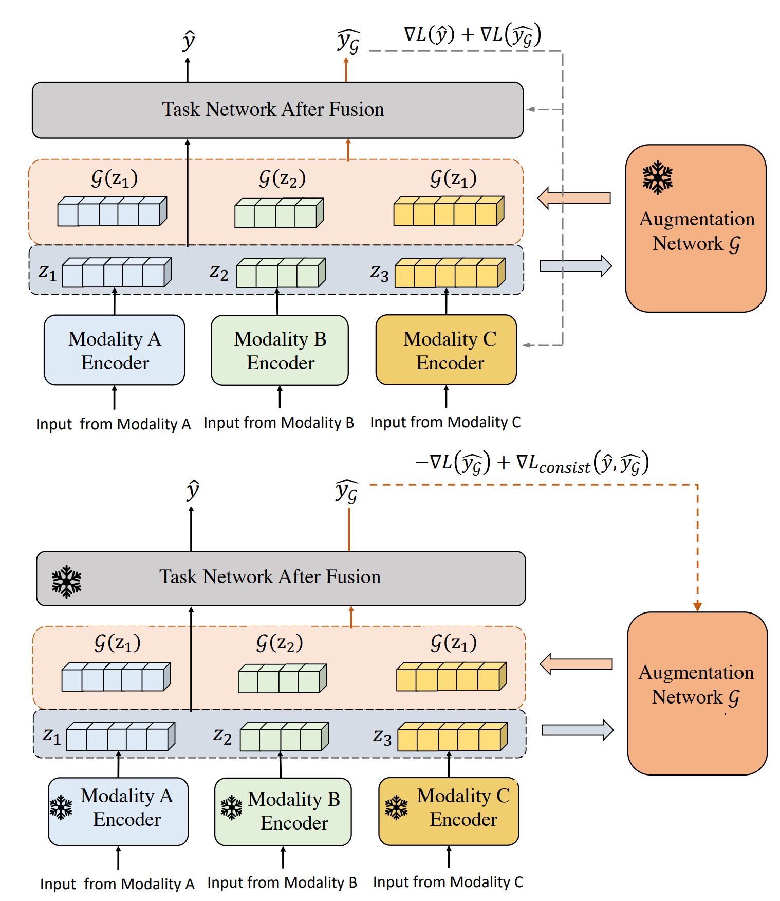

# Learning Multimodal Data Augmentation in Feature Space

This repo is the implementation of ["Learning Multimodal Data Augmentation in Feature Space"](https://openreview.net/forum?id=6SRDbbvU8s), which will appear at ICLR 2023.

## Introduction

The ability to jointly learn from multiple modalities, such as text, audio, and visual data, is a defining feature of intelligent systems. While there have been promising advances in designing neural networks to harness multimodal data, the enormous success of data augmentation currently remains limited to single-modality tasks like image classification. Indeed, it is particularly difficult to augment each modality while preserving the overall semantic structure of the data; for example, a caption may no longer be a good description of an image after standard augmentations have been applied, such as translation. Moreover, it is challenging to specify reasonable transformations that are not tailored to a particular modality. In this paper, we introduce LeMDA, Learning Multimodal Data Augmentation, an easy-to-use method that automatically learns to jointly augment multimodal data in feature space, with no constraints on the identities of the modalities or the relationship between modalities. We show that LeMDA can (1) profoundly improve the performance of multimodal deep learning architectures, (2) apply to combinations of modalities that have not been previously considered, and (3) achieve state-of-the-art results on a wide range of applications comprised of image, text, and tabular data.




## Installation
We extend a specific version of AutoGluon for implementation LeMDA. You can install AutoGluon via the following command.

```shell
./full_install.sh
```
## Example

We provide example on Petfinder. 

Data can be downloaded from:

https://drive.google.com/file/d/1AYDcrtfxlcIyvy9GzOripSR0QhItFTDG/view?usp=share_link

```
python petfinder.py
```

For turn on/off augmentation network and other configuration, please edit:

- text/src/autogluon/text/automm/configs/model fusion_mlp_image_text_tabular.yaml
- text/src/autogluon/text/automm/configs/optimization/adamw.yaml

## Citing LeMDA
BibTeX entry:

```bibtex
@inproceedings{liu2023lembda,
  title={Learning Multimodal Data Augmentation in Feature Space},
  author={Liu, Zichang and Tang, Zhiqiang and Shi, Xingjian and Zhang, Aston and Li, Mu and Shrivastava, Anshumali and Wilson, Andrew Gordon},
  booktitle={ICLR},
  year={2023}
}
```


## License

This library is licensed under the MIT License.
